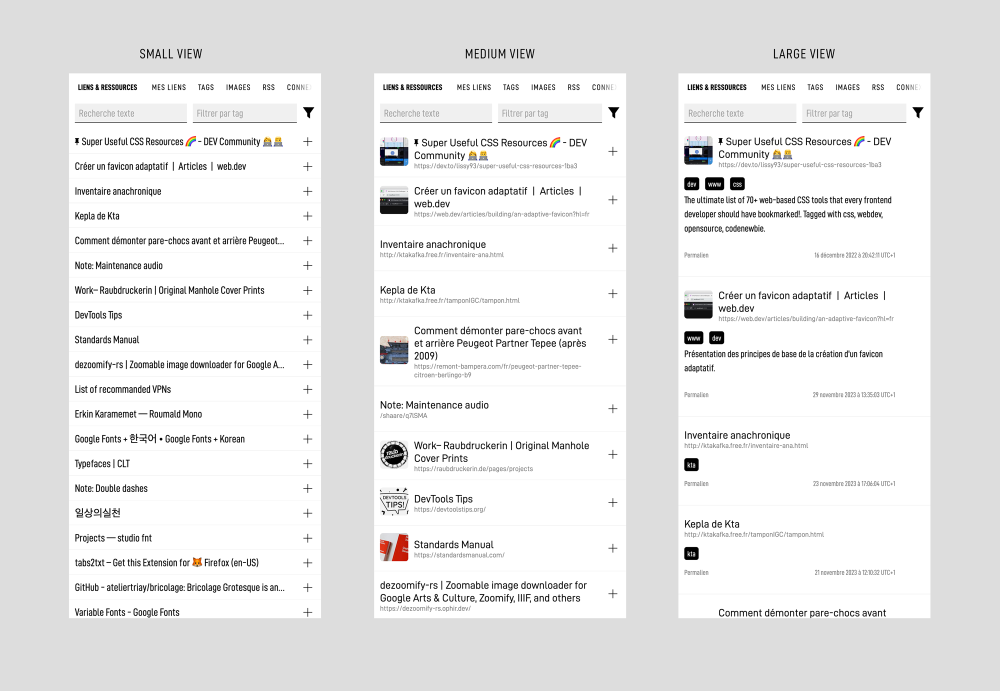
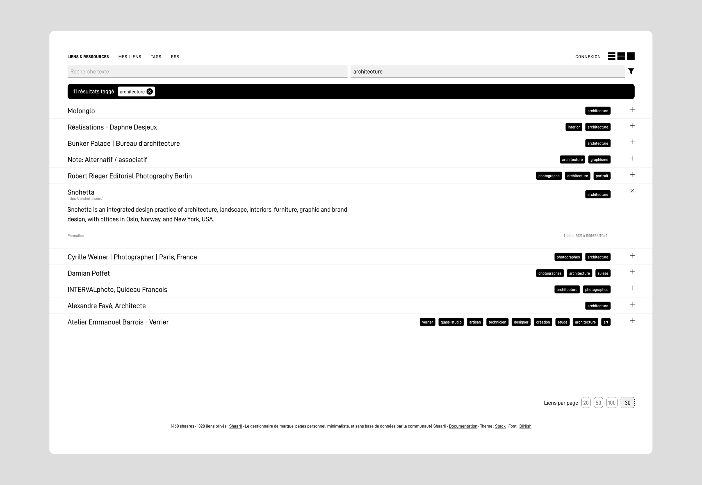
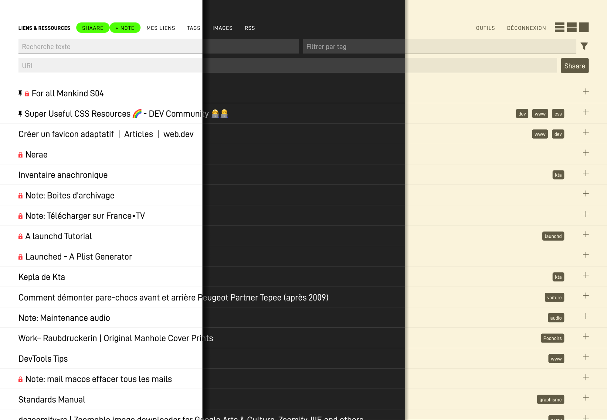
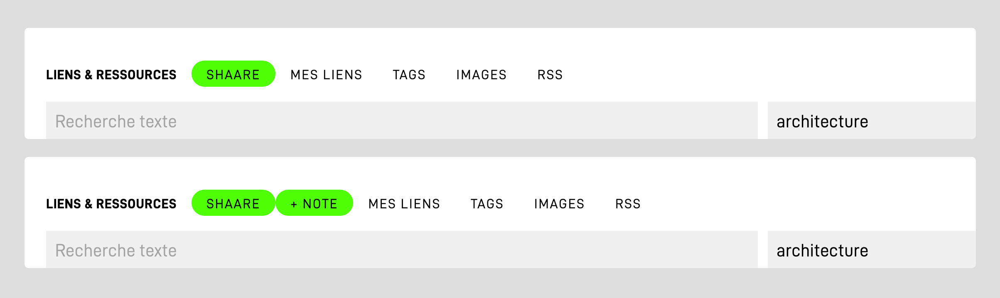

# Stack for Shaarli
Shaarli Stack is a theme for [Shaarli](https://github.com/shaarli/Shaarli), the personal, minimalist, bookmarking service.

Stack has been updated for Shaarli 0.13.0


---

## Differents views
Stack offers three display modes : small / medium /large.

The admin can set a default view and the user choose antoher one. The display is persistent, thanks to localStorage.






## Black or White or …
By default, Stack use `prefers-color-scheme` to match the user display.

You can also use the `default colors` plugin to set anything else.



## Set options in config.json.php


Thanks to [Shaarli-Material](https://github.com/kalvn/Shaarli-Material/), Stack now use the `config.json.php`,
to add options.

- You can choose the default view (small/medium/large). The user will still be free to set & save a different one.
- Hide the Daily tab (I never use it).
- Add a direct link to make a note (and save one clic!)




### How does it work ?
Options are stored in `data/config.json.php `: 

```js
  "config": {
    "STACK_HIDE_DAILY": true,
    "STACK_SHOW_NOTE": true,
    "STACK_DEFAULT_UI": "small" // small, medium or large
  },
```

Your `data/config.json.php ` should look like : 

```js
//  …
"resource": {
    "data_dir": "data",
    "config": "data/config.php",
    "datastore": "data/datastore.php",
    "ban_file": "data/ipbans.php",
    "updates": "data/updates.txt",
    "log": "data/log.txt",
    "update_check": "data/lastupdatecheck.txt",
    "history": "data/history.php",
    "raintpl_tpl": "tpl/",
    "theme": "stack",
    "raintpl_tmp": "tmp/",
    "thumbnails_cache": "cache",
    "page_cache": "pagecache"
  },
  "config": {
    "STACK_HIDE_DAILY": true,
    "STACK_SHOW_NOTE": true,
    "STACK_DEFAULT_UI": "small"
  },
//…
```


## 🧩 Supported or tested plugins

* markdown toolbar
* addlink toolbar
* default colors
* persistags
* playvideos
* qrcode
* wallabag

## 🏗 Installation

Upload `stack` folder to the `/tpl/` folder.
Activate it through admin panel.

## 💡 What next ?

*  Better accessibility
*  Optimize JS